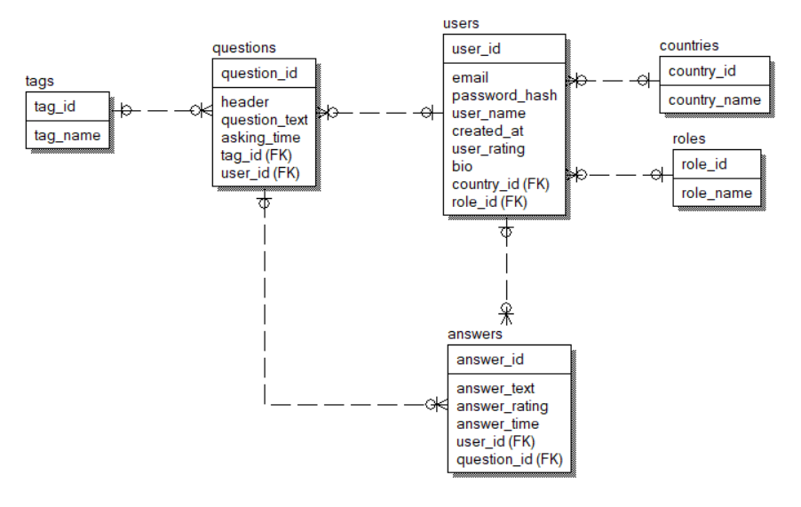

# AskTyler - сервис для ответов на вопросы

## Общая информация
Онлайн-платформа для обмена знаниями. Поддерживает различные категории пользователей. Сервис предоставляет удобный и функциональный интерфейс, который адаптируется под роль каждого пользователя (гость, клиент или администратор) и гарантирует доступ ко всем необходимым возможностям и инструментам.

## Пользователи и их возможности

### 1. Гость (неавторизованный пользователь)
* Может просматривать страницы вопросов и ответы на них
* Имеет доступ к информации об авторизованных пользователях
* Может регистрироваться и авторизовываться

### 2. Авторизованный пользователь (Клиент)
* Имеет все возможности гостя
* Может создавать (задавать) вопросы и отвечать на вопросы других пользователей
* Может редактировать и удалять свои вопросы и ответы
* Имеет личный кабинет (страничку) с информацией о нём (Логин, Страна, Био, Рейтинг, Заданные вопросы, Ответы)
* Может редактировать свой профиль
* Может выйти из системы
* Может удалить свой профиль (Вопросы и ответы пользователя не удалятся автоматически)

### 3. Админ
* Имеет все возможности клиента
* Может редактировать, удалять вопросы других пользователей
* Может банить других пользователей

## Вопрос
* Тема (текстовая)
* Рейтинг
* Текст вопроса
* Автор
* Дата (время) когда задан
* Тег (тема, но из списка заданного списка тем)

## Ответ на вопрос
* Рейтинг
* Текст ответа
* Автор
* Дата (время) когда дан

## Лента вопросов
Содержит вопросы отсортированные по ...

## Модель данных

